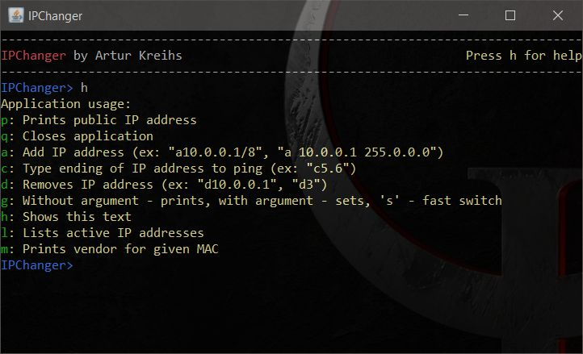

# IPChanger
Small java program to manage IP addresses of the network card in Windows system.\
I've made it to manage network card in a faster way. It also has some other useful commands.
## Features
- Listing of assigned IP addresses.
- Adding/removing IP addresses.
- Setting default gateway.
- Printing vendor of given MAC.
- Printing public IP address as seen from outside.
- Ping IP address given partially (last octets). Application will determine full IP based on the interface IP list.
## Setup
Compile to jar file. Then create shortcut to java with this jar and MAC address in the argument, like below:
```console
java -jar ipchanger.jar 000102030405
```
where *000102030405* is, of course, the MAC address of the network card to manage.  
Remember to give administrator's rights for this shortcut.  
## Application window

